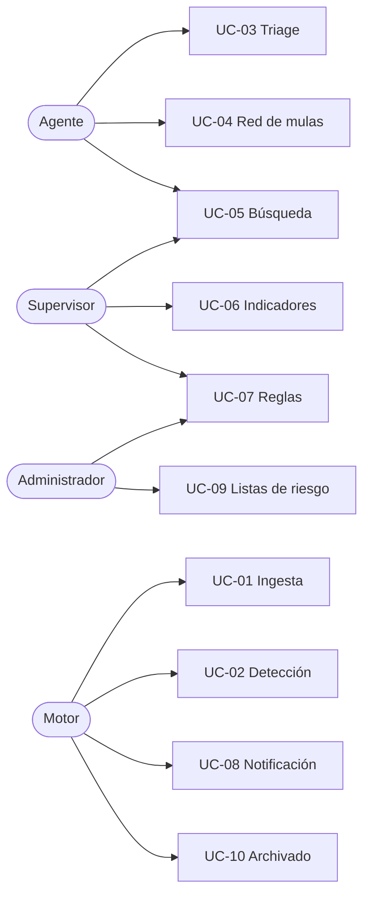

# 02 · Casos de uso

Diez flujos. Cada uno con actor, disparador, curso normal, excepciones y **un
ejemplo con datos concretos**, para que al implementarlo no haya que adivinar.

## Personaje de referencia

Todos los ejemplos usan la misma víctima, para que se lea como una sola historia.

| Campo | Valor |
|---|---|
| Cliente | María Rodríguez Vargas |
| Cuenta SINPE | `8712-4455` |
| Perfil (90 días) | 47 transferencias · promedio ₡45.200 · máximo ₡180.000 |
| Horario habitual | 07:00 – 19:00, días hábiles |
| Destinos frecuentes | 5 números, todos con 3+ transferencias previas |

---

## UC-01 · Ingesta de transacciones

| | |
|---|---|
| **Actor** | Generador sintético (proceso) |
| **Disparador** | Ejecución del script de carga |
| **Precondición** | Colecciones creadas con validadores activos |

**Curso normal**

1. El generador construye una transacción con cliente, cuenta origen, destino, monto, canal y marca de tiempo.
2. Inserta directamente en `transacciones`, sin pasar por la API.
3. MongoDB valida el documento contra `$jsonSchema`.
4. La inserción queda en el oplog y la ve el motor de detección.

**Excepciones**

- *Documento inválido:* Mongo rechaza la escritura; el generador lo registra y continúa.
- *Nodo primario caído:* el driver reintenta contra el nuevo primario tras la elección.

> **Por qué la ingesta no pasa por la API:** el volumen realista de un flujo
> transaccional no debe atravesar la capa HTTP. Además demuestra que la detección
> reacciona a **la base de datos**, no a nuestro endpoint.

---

## UC-02 · Detección automática y creación de alerta

| | |
|---|---|
| **Actor** | Motor de detección (Change Stream D1) |
| **Disparador** | Inserción en `transacciones` |
| **Precondición** | Reglas activas y perfil del cliente calculado |

**Curso normal**

1. El motor recibe el evento `insert` desde el Change Stream.
2. Carga el perfil de comportamiento del cliente y las reglas activas.
3. Evalúa cada regla; las que disparan aportan su peso al puntaje.
4. Si el puntaje supera el umbral, crea un documento en `alertas` con el detalle de **qué reglas dispararon y por qué**.
5. Emite el evento por WebSocket al panel.

**Excepciones**

- *Sin perfil (cliente nuevo):* se aplica el perfil poblacional y se marca `perfil_provisional: true`.
- *Puntaje bajo umbral:* no se crea alerta; la transacción queda para consulta forense.

**Ejemplo**

> **22:47** — María transfiere **₡750.000** a `6033-9001`, un número que nunca
> había usado.
>
> | Regla | Dispara | Peso |
> |---|---|---|
> | R-01 Monto sobre 10× el promedio | ✅ 16,6× | 35 |
> | R-03 Destino nunca visto | ✅ | 25 |
> | R-05 Fuera del horario habitual | ✅ 22:47 | 15 |
> | R-07 Destino en lista de riesgo | ❌ | 0 |
> | R-09 Velocidad anómala | ❌ | 0 |
>
> **Puntaje 75 → severidad CRÍTICA.** Se crea la alerta y aparece en el panel
> del agente en menos de un segundo.

---

## UC-03 · Triage de una alerta

| | |
|---|---|
| **Actor** | Agente de fraude |
| **Disparador** | Alerta nueva en el panel |

**Curso normal**

1. El agente abre la alerta y ve la transacción, el perfil del cliente y las reglas que dispararon.
2. Contacta al cliente por el canal establecido.
3. Resuelve con una de tres salidas: **confirmada** (es fraude), **descartada** (falso positivo) o **escalada** a caso.
4. La acción se agrega al historial embebido de la alerta con agente, marca de tiempo y nota.

**Excepciones**

- *Alerta ya tomada por otro agente:* el sistema responde conflicto; se recarga el estado actual.
- *Cliente no contesta:* queda `en_revision` con recordatorio.

**Ejemplo**

> El agente Jose Solís abre la alerta de María, la llama, y ella confirma que
> "un funcionario del banco" la guió por teléfono. Marca **confirmada**. El
> historial embebido registra `{agente: "jsolis", accion: "confirmada", ts: "22:53", nota: "Cliente confirma llamada previa"}`.

---

## UC-04 · Investigación de red de mulas

| | |
|---|---|
| **Actor** | Agente de fraude |
| **Disparador** | Alerta confirmada como fraude |

**Curso normal**

1. Desde la alerta confirmada, el agente pide "seguir el dinero".
2. El sistema recorre recursivamente las transferencias que salen del destino.
3. Devuelve la cadena con saltos, montos y tiempos entre eslabones.
4. Las cuentas de la cadena se proponen para la lista de riesgo.

**Excepciones**

- *Cadena sin salidas:* el dinero sigue en la primera cuenta; es la mejor noticia posible.
- *Cadena muy profunda:* se corta a 6 saltos para acotar la consulta.

**Ejemplo**

> Desde `6033-9001` el sistema encuentra:
>
> `6033-9001` → `7104-2288` (₡740.000, +4 min) → `8455-1177` (₡500.000, +9 min) → `6001-3344` (₡240.000, +11 min)
>
> Tres saltos en 24 minutos, con montos decrecientes: el patrón clásico de
> fragmentación. Las tres cuentas se proponen para la lista de riesgo.

> **Nota técnica:** esto se resuelve con `$graphLookup` dentro de MongoDB. No se
> agrega una base de datos de grafos.

---

## UC-05 · Búsqueda forense

| | |
|---|---|
| **Actor** | Agente o supervisor |
| **Disparador** | Necesidad de reconstruir un caso |

**Curso normal**

1. El usuario filtra por rango de fecha, monto, cuenta, canal o estado.
2. El sistema consulta el histórico apoyado en índices.
3. Devuelve resultados paginados y ordenados.

**Excepciones**

- *Consulta sin índice de apoyo:* se registra para revisión; toda consulta del panel debe usar índice.
- *Resultado muy grande:* se pagina y se sugiere acotar el rango.

**Ejemplo**

> "Todas las transferencias sobre ₡500.000 hacia números que no estaban en la
> lista de contactos del cliente, entre el 1 y el 15 de octubre." → 1.284
> resultados, primera página en 40 ms usando el índice `cuenta_origen + timestamp`.

---

## UC-06 · Panel de indicadores del turno

| | |
|---|---|
| **Actor** | Supervisor |
| **Disparador** | Apertura del panel |

**Curso normal**

1. El sistema lee los indicadores ya materializados.
2. Muestra alertas por estado, por severidad, por agente y por hora.
3. Compara contra el mismo día de la semana anterior.

**Excepción**

- *Indicadores desactualizados:* se muestra la marca de tiempo del último cálculo; nunca se recalcula al vuelo en la petición.

**Ejemplo**

> Turno nocturno del 14 de octubre: 47 alertas, 8 confirmadas, 31 descartadas,
> 8 en revisión. Tasa de falsos positivos 66 %. La regla R-05 (horario) es la que
> más ruido genera → candidata a que el supervisor le baje el peso.

---

## UC-07 · Ajuste de una regla de detección

| | |
|---|---|
| **Actor** | Supervisor |
| **Disparador** | Demasiados falsos positivos o fraude que se escapa |

**Curso normal**

1. El supervisor abre el catálogo de reglas.
2. Modifica umbral, peso o estado de una regla.
3. El cambio se versiona: la regla anterior se conserva.
4. Las alertas nuevas usan la regla actualizada; las viejas conservan la versión con la que se evaluaron.

**Excepción**

- *Regla en uso por alertas abiertas:* se permite el cambio, pero las alertas abiertas guardan la versión con la que nacieron.

**Ejemplo**

> R-05 baja de peso 15 a 8 porque genera 40 % de los falsos positivos. La versión
> 1 queda archivada; las alertas creadas antes del cambio siguen mostrando que se
> evaluaron con peso 15. **Esto es trazabilidad de decisiones, no historial decorativo.**

---

## UC-08 · Notificación de riesgo crítico

| | |
|---|---|
| **Actor** | Motor de notificación (Change Stream D2) |
| **Disparador** | Alerta creada con severidad crítica |

**Curso normal**

1. El motor detecta la alerta crítica.
2. Compone y envía el correo al canal de guardia.
3. Registra el envío en `notificaciones`.

**Excepciones**

- *Fallo de SMTP:* se registra el intento fallido y se reintenta con espera creciente.
- *Ráfaga de alertas:* se agrupan en un solo correo por ventana de 5 minutos para no inundar.

---

## UC-09 · Gestión de listas de riesgo

| | |
|---|---|
| **Actor** | Administrador |
| **Disparador** | Cuenta identificada como mula |

**Curso normal**

1. Se agrega la cuenta con motivo, origen del reporte y fecha.
2. Desde ese momento la regla R-07 dispara con peso máximo para esa cuenta.
3. La entrada tiene vigencia; al vencer se revisa.

**Excepción**

- *Cuenta ya en lista:* se acumula el reporte en vez de duplicar la entrada.

---

## UC-10 · Archivado del histórico

| | |
|---|---|
| **Actor** | Proceso programado |
| **Disparador** | Transacciones limpias con más de N días |

**Curso normal**

1. El proceso identifica transacciones sin alerta más antiguas que la ventana.
2. Las mueve a la colección de archivo o las elimina según política.
3. Registra cuántos documentos procesó.

**Excepción**

- *Transacción ligada a una alerta abierta o a un caso:* nunca se archiva.

---

## Mapa: casos de uso × actores

