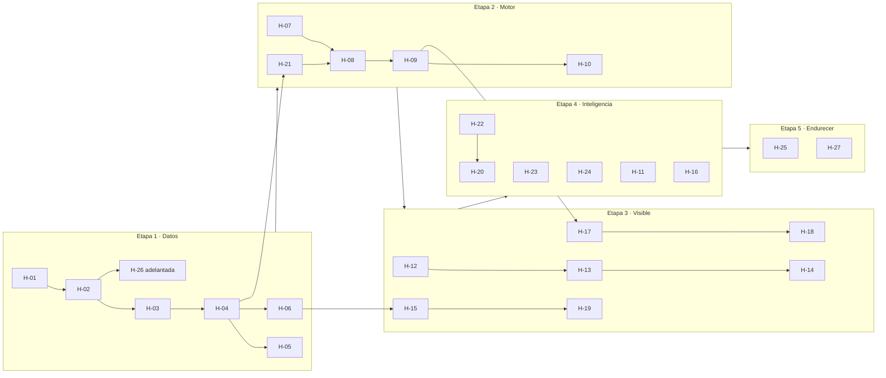

# 03 · Historias de usuario

Backlog del MVP. **Cada historia es tomable sin preguntar nada**: quien la levante
encuentra aquí el porqué, los criterios de aceptación y de qué depende.

## Cómo se lee

| Campo | Significado |
|---|---|
| **Talla** | S ≈ media sesión · M ≈ 1–2 sesiones · L ≈ una semana de una persona |
| **Depende de** | No se puede empezar hasta que esas historias estén terminadas |
| **Etapa** | En qué momento de la evolución entra (ver [04 · Arquitectura](04-arquitectura.md)) |

**Definición de terminado (aplica a todas):** el código corre sin error, tiene al
menos una verificación reproducible, está documentado en una línea en el doc que
corresponda, y quien la tomó puede demostrarla en 2 minutos.

---

# Épica E1 · Fundación de datos

> Sin datos que se comporten como los reales, todo lo demás es teatro.

### H-01 · Definir el esquema de las 11 colecciones
**Como** arquitecto de datos, **quiero** un esquema formal de cada colección con
tipos y ejemplos, **para** que todos escribamos documentos con la misma forma.

- **Criterios:** las 11 colecciones documentadas con propósito, campos, tipos, y un documento de ejemplo real; cada relación declarada como *embebida* o *referenciada* con su justificación.
- **Talla:** M · **Etapa:** E1 · **Depende de:** —
- **Es la Práctica 1 (vence 28 sep), pero con alcance recortado**: la práctica no
  pide los 100.000 documentos de H-04/H-05, pide el molde de `HospitalDB.js` —
  un script que hace `dropDatabase()`, crea las 11 colecciones con **un puñado de
  documentos de ejemplo a mano** (no generados), sus índices con nombre, y
  consultas de comprobación al final. Ese script entregable es H-01 + H-02 + un
  recorte mínimo de H-06; el generador Faker real (H-03/H-04/H-05) sigue después,
  a escala de proyecto, sin fecha de entrega propia.

### H-02 · Activar validadores `$jsonSchema`
**Como** ingeniero de datos, **quiero** que la base rechace documentos malformados,
**para** no descubrir la basura tres semanas después.

- **Criterios:** cada colección tiene validador; un documento inválido es rechazado y el error se puede mostrar; los campos obligatorios y los tipos están declarados.
- **Talla:** M · **Etapa:** E1 · **Depende de:** H-01

### H-03 · Generador de población y perfiles
**Como** ingeniero de datos, **quiero** generar clientes con hábitos distintos,
**para** que el motor tenga contra qué comparar.

- **Criterios:** genera N clientes con cuentas, rango de montos, horario habitual y destinos frecuentes propios; dos ejecuciones con la misma semilla producen lo mismo.
- **Talla:** M · **Etapa:** E1 · **Depende de:** H-02

### H-04 · Generador de transacciones legítimas
**Como** ingeniero de datos, **quiero** un flujo de transacciones normales,
**para** tener la línea base del comportamiento.

- **Criterios:** respeta el perfil de cada cliente; distribuye por hora del día de forma realista; inserta a ritmo configurable; supera 100.000 documentos sin degradarse.
- **Talla:** M · **Etapa:** E1 · **Depende de:** H-03

### H-05 · Inyector de patrones de fraude
**Como** ingeniero de datos, **quiero** inyectar vishing realista, **para** poder
medir si el motor lo atrapa.

- **Criterios:** implementa al menos 3 patrones (monto atípico a destino nuevo, fragmentación en ráfaga, cadena de mulas encadenada); el fraude es menos del 2 % del volumen; cada transacción fraudulenta queda etiquetada en un campo oculto **solo para medir**, que el motor nunca lee.
- **Talla:** L · **Etapa:** E1 · **Depende de:** H-04

### H-06 · Índices y su verificación
**Como** arquitecto de datos, **quiero** los índices que las consultas necesitan,
**para** que el panel no se arrodille con volumen.

- **Criterios:** índice compuesto para el flujo del panel y otro para búsqueda por cuenta; cada consulta del sistema tiene su `explain()` guardado mostrando `IXSCAN` y no `COLLSCAN`.
- **Talla:** M · **Etapa:** E1 · **Depende de:** H-04

---

# Épica E2 · Motor de detección

> El corazón del sistema. Se construye **sin interfaz**: primero que acierte.

### H-07 · Catálogo de reglas en base de datos
**Como** supervisor, **quiero** que las reglas vivan en la base y no en el código,
**para** ajustarlas sin esperar un despliegue.

- **Criterios:** al menos 6 reglas con código, descripción, tipo, umbral, peso y estado; se pueden activar y desactivar; cambiar un umbral cambia el comportamiento sin tocar código.
- **Talla:** M · **Etapa:** E2 · **Depende de:** H-02

### H-08 · Evaluador de reglas y puntaje
**Como** motor, **quiero** evaluar una transacción contra las reglas activas,
**para** producir un puntaje con su justificación.

- **Criterios:** dada una transacción y un perfil devuelve puntaje, severidad y **la lista de reglas que dispararon con su aporte**; es una función pura y probable sin base de datos.
- **Talla:** L · **Etapa:** E2 · **Depende de:** H-07

### H-09 · Disparador D1: transacción → alerta
**Como** motor, **quiero** reaccionar a cada inserción, **para** crear la alerta
en el momento.

- **Criterios:** escucha `transacciones` por Change Stream; crea la alerta cuando supera umbral; **sobrevive a la caída del primario retomando desde donde quedó** (`resumeToken` persistido); no duplica alertas si se reinicia.
- **Talla:** L · **Etapa:** E2 · **Depende de:** H-08

### H-10 · Medición de efectividad del motor
**Como** equipo, **quiero** saber cuánto fraude atrapamos, **para** ajustar con
evidencia y no con opinión.

- **Criterios:** un reporte compara las alertas contra la etiqueta oculta de H-05 y muestra detectados, perdidos y falsos positivos; se puede correr después de cada ajuste de reglas.
- **Talla:** M · **Etapa:** E2 · **Depende de:** H-09, H-05

### H-11 · Disparador D2: correo en riesgo crítico
**Como** agente de guardia, **quiero** un correo cuando algo crítico entra,
**para** enterarme aunque no esté viendo el panel.

- **Criterios:** escucha `alertas`; envía por SMTP de pruebas; agrupa ráfagas en ventana de 5 minutos; registra cada envío en `notificaciones`; un fallo de SMTP no tumba el proceso.
- **Talla:** M · **Etapa:** E4 · **Depende de:** H-09

---

# Épica E3 · API y consultas

### H-12 · Esqueleto de API con conexión al replica set
**Como** desarrollador, **quiero** la API levantando y conectada, **para** tener
dónde colgar lo demás.

- **Criterios:** arranca con un comando; expone verificación de salud que confirma el replica set; la cadena de conexión sale de variables de entorno; documentación OpenAPI accesible.
- **Talla:** S · **Etapa:** E1 · **Depende de:** —

### H-13 · Consulta de alertas con filtros y paginación
**Como** agente, **quiero** filtrar alertas por estado, severidad y fecha,
**para** trabajar mi cola.

- **Criterios:** filtros combinables; resultados paginados con total; ordenamiento por puntaje o fecha; la consulta usa índice.
- **Talla:** M · **Etapa:** E3 · **Depende de:** H-12, H-06

### H-14 · Resolver una alerta
**Como** agente, **quiero** marcar una alerta como confirmada, descartada o
escalada, **para** cerrar mi trabajo dejando rastro.

- **Criterios:** cambia el estado y **agrega** al historial embebido sin sobrescribirlo; si otro agente ya la tomó devuelve conflicto; escalar a caso crea el caso en la misma transacción multi-documento.
- **Talla:** M · **Etapa:** E3 · **Depende de:** H-13

### H-15 · Búsqueda forense sobre el histórico
**Como** analista, **quiero** buscar transacciones por múltiples criterios,
**para** reconstruir un caso.

- **Criterios:** filtros por rango de fecha, monto, cuenta, canal y estado; usa operadores de consulta; responde en menos de 200 ms sobre 100.000 documentos; devuelve el plan de ejecución bajo una bandera de depuración.
- **Talla:** M · **Etapa:** E3 · **Depende de:** H-06

### H-16 · Gestión de reglas desde la API
**Como** supervisor, **quiero** editar reglas sin tocar la base a mano, **para**
ajustar el motor durante el turno.

- **Criterios:** listar, crear, editar y desactivar; al editar se **versiona** la anterior; las alertas existentes conservan la versión con la que se evaluaron.
- **Talla:** M · **Etapa:** E4 · **Depende de:** H-07, H-12

---

# Épica E4 · Portal del agente

### H-17 · Panel de alertas en vivo
**Como** agente, **quiero** que las alertas aparezcan solas, **para** no estar
recargando.

- **Criterios:** se conecta por WebSocket; una alerta nueva aparece en menos de 2 segundos sin intervención; si se cae la conexión se reconecta y recupera lo perdido; ordenadas por severidad.
- **Talla:** L · **Etapa:** E3 · **Depende de:** H-09, H-13

### H-18 · Detalle de alerta con explicación
**Como** agente, **quiero** ver **por qué** se marcó, **para** decidir en segundos.

- **Criterios:** muestra la transacción, el perfil del cliente y **las reglas que dispararon con su aporte al puntaje**; muestra el historial de acciones; permite resolver desde ahí.
- **Talla:** M · **Etapa:** E3 · **Depende de:** H-17, H-14

### H-19 · Pantalla de búsqueda
**Como** analista, **quiero** una pantalla de búsqueda con filtros, **para**
investigar sin pedirle a nadie una consulta.

- **Criterios:** filtros combinables, resultados paginados, exportable a CSV.
- **Talla:** M · **Etapa:** E3 · **Depende de:** H-15

### H-20 · Tablero de indicadores
**Como** supervisor, **quiero** ver cómo va el turno, **para** dirigir al equipo.

- **Criterios:** alertas por estado, severidad, agente y hora; comparación contra el período anterior; muestra la marca de tiempo del último cálculo.
- **Talla:** M · **Etapa:** E4 · **Depende de:** H-22

---

# Épica E5 · Inteligencia

### H-21 · Perfiles de comportamiento materializados
**Como** motor, **quiero** el perfil de cada cliente precalculado, **para** no
recalcularlo en cada transacción.

- **Criterios:** un pipeline de agregación calcula promedio, desviación, máximo, horario habitual y destinos frecuentes; escribe el resultado con `$merge`; es reejecutable sin duplicar; se puede correr para un cliente o para todos.
- **Talla:** L · **Etapa:** E2 · **Depende de:** H-04

### H-22 · Indicadores diarios materializados
**Como** supervisor, **quiero** los indicadores precalculados, **para** que el
tablero abra al instante.

- **Criterios:** pipeline con `$match`, `$group`, `$sort` y `$project` que materializa con `$merge`; es idempotente; la colección resultante queda documentada como **vista materializada**.
- **Talla:** M · **Etapa:** E4 · **Depende de:** H-09

### H-23 · Red de cuentas mula
**Como** agente, **quiero** seguir el dinero a través de la cadena, **para**
entender el alcance real del fraude.

- **Criterios:** recorre la cadena de transferencias con `$graphLookup` hasta 6 saltos; devuelve la ruta con montos y tiempos entre eslabones; se visualiza como grafo en el portal; propone las cuentas de la cadena para la lista de riesgo.
- **Talla:** L · **Etapa:** E4 · **Depende de:** H-04

### H-24 · Vistas de consulta guardadas
**Como** arquitecto de datos, **quiero** las consultas recurrentes guardadas en el
servidor, **para** que la lógica de lectura no se disperse por el código.

- **Criterios:** al menos 3 vistas creadas con `db.createView()`; documentadas con su pipeline y su propósito; consumidas desde la API como si fueran colecciones.
- **Talla:** M · **Etapa:** E4 · **Depende de:** H-06

---

# Épica E6 · Seguridad y operación

### H-25 · Autenticación y roles
**Como** administrador, **quiero** que cada quien vea lo suyo, **para** que el
sistema sea defendible.

- **Criterios:** login con contraseña cifrada; token con rol; agente, supervisor y administrador tienen permisos distintos; existen usuarios de base de datos con roles diferenciados.
- **Talla:** M · **Etapa:** E5 · **Depende de:** H-12

### H-26 · Versionado de esquema y migración
**Como** ingeniero de datos, **quiero** poder evolucionar el documento sin romper
lo viejo, **para** demostrar una migración real.

- **Criterios:** los documentos llevan versión de esquema; existe un script que migra de v1 a v2 y es reejecutable; el sistema lee ambas versiones durante la transición.
- **Talla:** M · **Etapa:** E1 (adelantada) · **Depende de:** H-02
- **⚠️ Reubicada el 2026-09-20**: por Épica pertenece a "Seguridad y operación" (E5,
  diciembre), pero **la Práctica 4 del curso ("sellos de versiones") vence el 19 de
  octubre** y es exactamente este tema. Se adelanta a Etapa E1 para que exista a
  tiempo; en diciembre solo se revisa que la migración siga funcionando sobre el
  esquema final.

### H-27 · Archivado del histórico
**Como** operador, **quiero** purgar lo viejo y limpio, **para** que la colección
caliente no crezca sin control.

- **Criterios:** archiva transacciones sin alerta más antiguas que la ventana; **nunca** toca las ligadas a alertas abiertas o casos; reporta cuántos documentos movió.
- **Talla:** S · **Etapa:** E5 · **Depende de:** H-09

---

## Orden sugerido de ataque

## Reparto por paquete

| Paquete | Historias | Foco |
|---|---|---|
| **P1 · Datos** | H-01, H-02, H-03 a H-06, **H-26 (adelantada)** | Esquema, validadores, generador, índices, versionado |
| **P2 · Motor** | H-07 a H-11, H-21 | Reglas, puntaje, Change Streams, correo |
| **P3 · API** | H-12 a H-16, H-22 a H-24 | Endpoints, agregaciones, vistas, grafos |
| **P4 · Portal** | H-17 a H-20, H-25 | Pantallas, tiempo real, autenticación |

Cuatro paquetes, cuatro personas. Las dependencias cruzadas están explícitas en
cada historia: P4 no puede terminar H-17 antes de que P2 cierre H-09.

**Cruce con las fechas del curso (revisado 2026-09-20)** — ver el reparto
semana a semana completo en el cerebro (`sc609-reparto-semanal`) y en el
mensaje de la sesión del 20 sep. Dos hallazgos que ya están corregidos arriba:

1. **H-26 estaba en Etapa E5 (diciembre) pero la Práctica 4 del curso
   ("sellos de versiones") vence el 19 de octubre.** Se adelantó a Etapa E1.
2. **Práctica 1 (corregida a 28 sep) y Práctica 2 caen el mismo lunes.** P1 es
   H-01+H-02 con alcance recortado (estilo `HospitalDB.js`, no el generador
   completo); P2 ya está resuelta por la infraestructura de E0 (el replica set),
   solo falta documentarla/demostrarla — no es carga nueva de código.

## Cómo se divide en las 3 grandes entregas (no es el mismo reparto en las tres)

**Etapa 1 (hasta Avance 1, 26 oct) — paralelo real.** Los primeros 8 días (hasta
Práctica 1+2, 28 sep) son de los 4 juntos en H-01/H-02. Después se separan:
A sigue con H-03–H-06+H-26, B adelanta H-07, C hace H-12 (Práctica 3), y **D dejar
de programar y se vuelve el integrador del Avance 1** (IEEE de 12 apartados,
redacción a mano) — repartir la redacción "un párrafo cada uno" sale descosido.

**Etapa 2 (hasta Avance 2, 16 nov) — es una posta, no paralelo.** Nada del panel
puede existir sin el motor. Semana 1: B ataca H-07→H-08→H-09 (el cuello de
botella) y **A se presta para acelerarlo** en vez de trabajar solo en algo que
no bloquea a nadie; mientras tanto C construye H-13/H-14 contra una alerta falsa
y D arma las pantallas con datos de mentira, sin esperar. Semana 2: en cuanto
H-09 existe, C y D conectan lo real (es un *swap*, no un arranque de cero).
Semana 3: los 4 en integración y ensayo de la demo.

**Etapa 3 (hasta Entrega final, 7 dic) — paralelo otra vez.** A: H-27 + IEEE
final. B: H-11 + H-23 (`$graphLookup`, el momento más vistoso de la demo).
C: H-22, H-24, H-20. D: H-25. **Última semana (1-7 dic): cero funcionalidad
nueva** — congelar, subir a GitHub, ensayar la defensa, verificar cero errores
en tiempo de ejecución (vale tanto como disparadores y procedimientos juntos).
