# 04 · Arquitectura

Los diagramas renderizan solos en GitHub. Este documento es **vivo**: la sección
de evolución se actualiza conforme cerramos etapas.

## 1. Reglas de oro

| Regla | Qué significa |
|---|---|
| **La ingesta no pasa por la API** | El generador escribe directo en MongoDB. La detección reacciona a la base de datos, no a nuestro endpoint |
| **El motor no sabe que existe una pantalla** | Se construye headless. Si el portal desaparece, el motor sigue creando alertas correctas |
| **Las reglas viven en datos, no en código** | Cambiar un umbral no requiere desplegar |
| **La lógica de lectura recurrente vive en el servidor** | Vistas y pipelines materializados; la API los consume, no los reimplementa |
| **Nada se recalcula dentro de una petición HTTP** | Los indicadores se materializan aparte; el tablero solo lee |
| **La alerta guarda por qué se creó** | Puntaje, reglas disparadas y versión de cada regla quedan dentro del documento |

## 2. Contexto

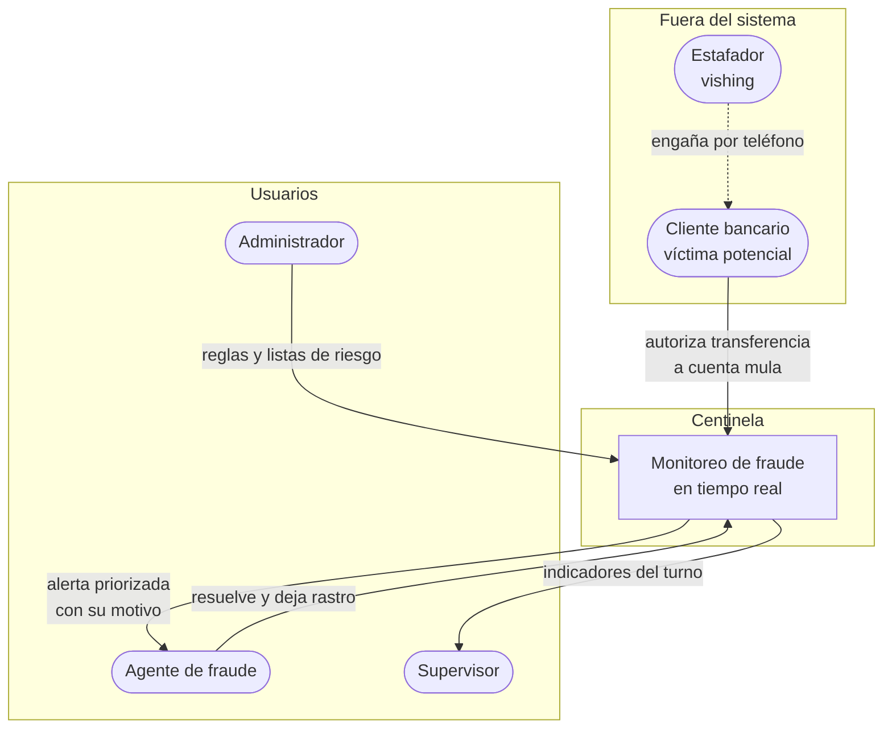

## 3. Contenedores

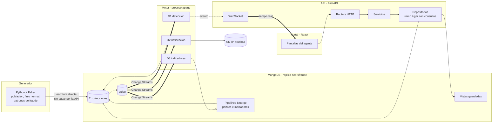

## 4. El flujo que define el producto

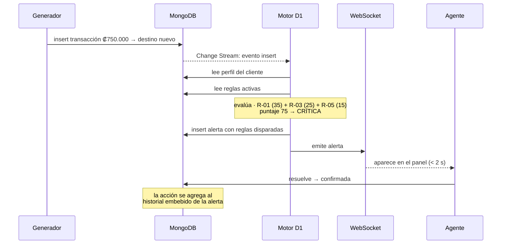

## 5. Decisiones de modelado

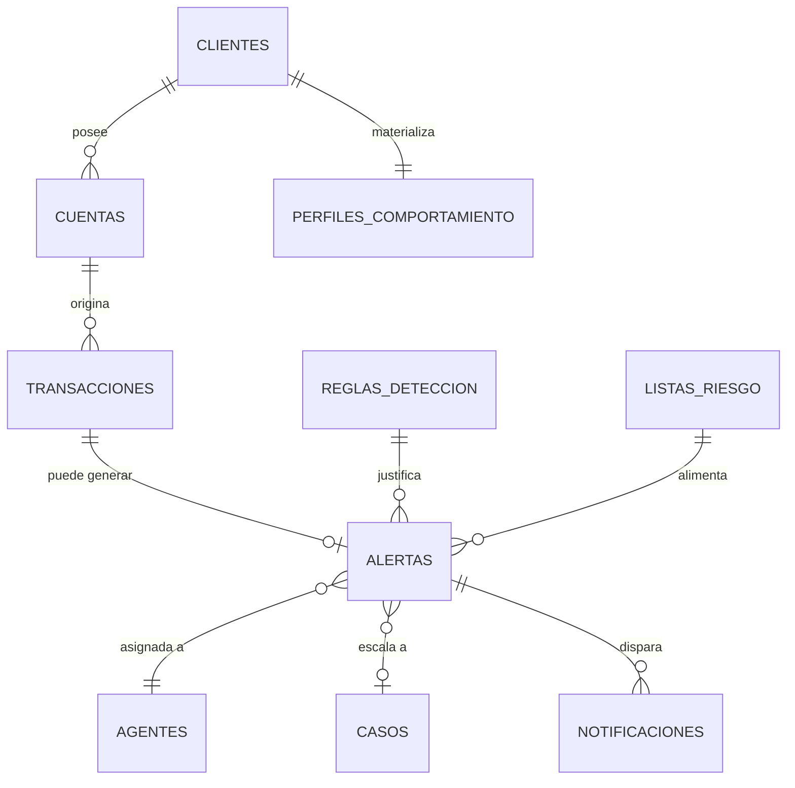

| Decisión | Elección | Por qué |
|---|---|---|
| Historial de acciones de una alerta | **Embebido** | Se lee siempre con la alerta, nunca solo. Crece acotado |
| Alerta → agente | **Referencia** | Cambia de dueño con frecuencia; duplicar el agente sería incoherente |
| Reglas disparadas dentro de la alerta | **Copia embebida con versión** | La alerta debe poder explicarse dentro de un año, aunque la regla haya cambiado |
| Perfil de comportamiento | **Colección materializada** | Se calcula caro y se lee en cada transacción |
| Indicadores | **Colección materializada** | El tablero abre al instante; nada se agrega dentro de la petición |

## 6. Evolución: cómo llegamos ahí

Seis etapas. **Cada una deja algo que funciona**, no un pedazo inerte.

### E0 · Fundación — ✅ terminada

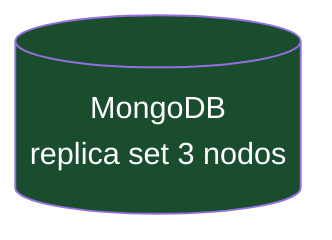

Replica set `rsfraude` corriendo con Change Streams, transacciones
multi-documento y `$graphLookup` verificados. Repo estructurado.
**Se puede demostrar:** `rs.status()` con un primario y dos secundarios.

---

### E1 · Los datos existen

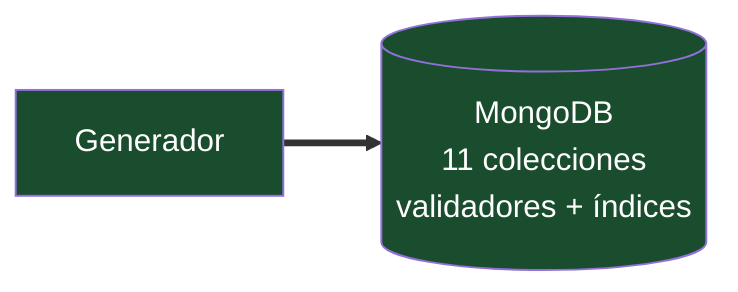

Historias **H-01 a H-06, H-12**. Hay clientes con hábitos, transacciones que
respetan esos hábitos, fraude inyectado como minoría, y consultas que usan índice.
**Se puede demostrar:** 100.000 transacciones consultadas con `IXSCAN`.
**Alimenta la Práctica 1 del 21 de septiembre.**

---

### E2 · El motor ve — *aquí el proyecto deja de ser un CRUD*

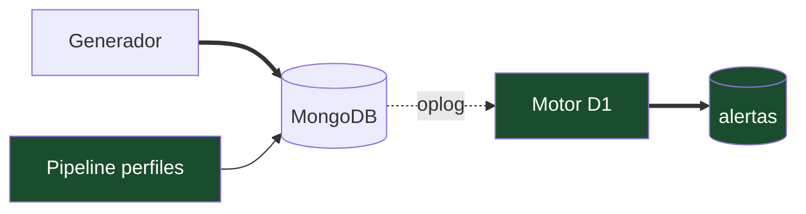

Historias **H-07 a H-10, H-21**. El Change Stream reacciona, evalúa contra reglas
configurables y crea alertas explicadas. Todavía **sin una sola pantalla**.
**Se puede demostrar:** correr el generador y ver alertas apareciendo en `mongosh`,
con el reporte de efectividad diciendo cuánto fraude se atrapó.

---

### E3 · El agente ve — meta del Avance 2 (16 nov)

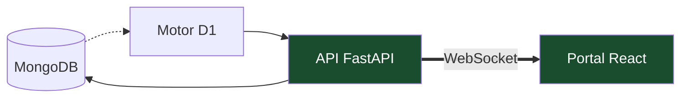

Historias **H-13 a H-15, H-17 a H-19**. Las alertas aparecen solas en el panel,
el agente las resuelve y queda rastro. **Es exactamente lo que pide el Avance 2:
pantallas ejecutando con toma de decisiones.**

---

### E4 · Inteligencia

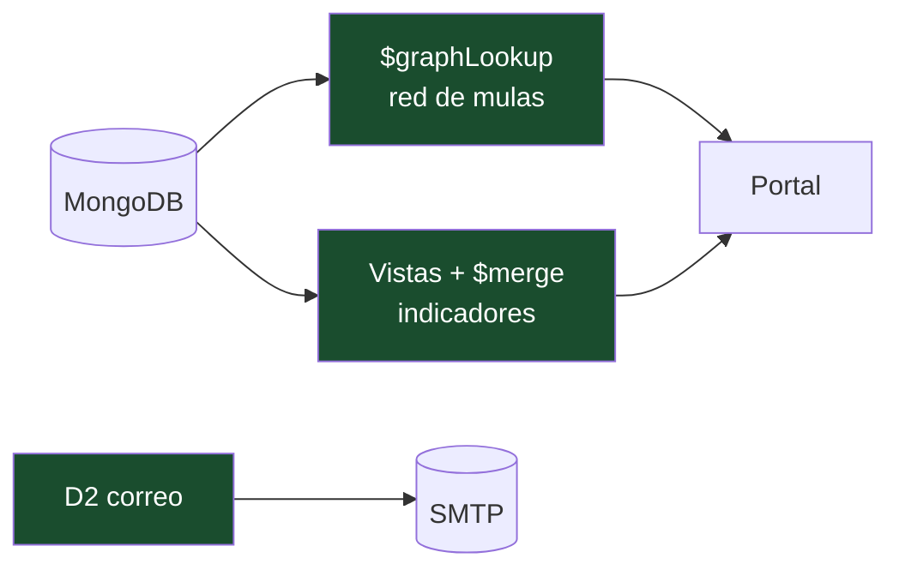

Historias **H-11, H-16, H-20, H-22 a H-24**. La cadena de mulas se recorre y se
dibuja, los indicadores se materializan, el correo sale.
**Es donde el sistema deja de reportar hechos sueltos y empieza a explicar un patrón.**

---

### E5 · Endurecimiento

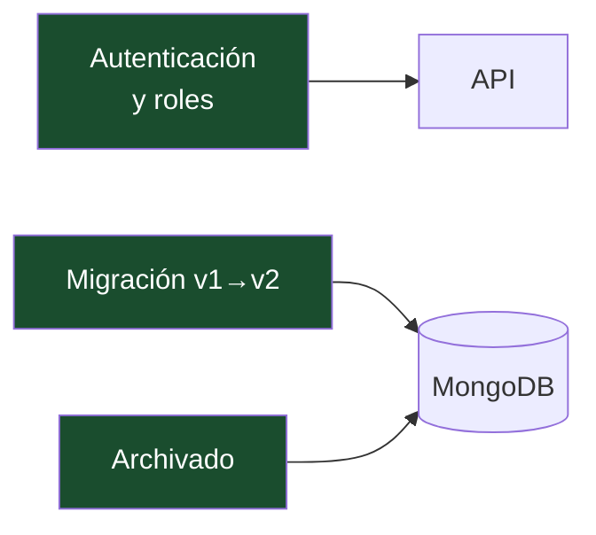

Historias **H-25 a H-27**. Roles, versionado de esquema con migración real,
purga del histórico. Aquí el sistema se vuelve defendible, no solo demostrable.

---

## 7. Calendario de etapas

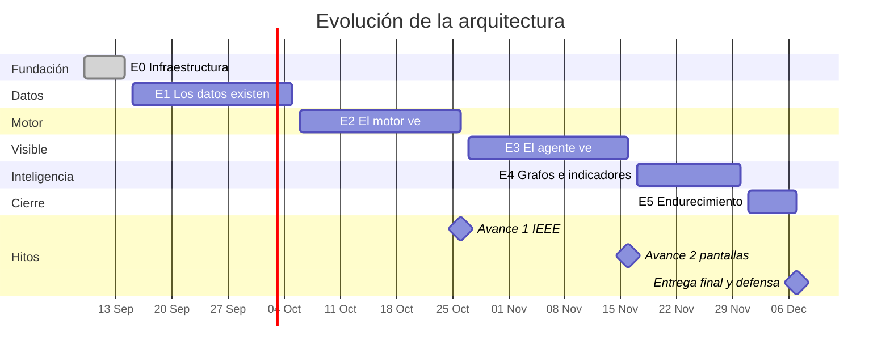

## 8. Glosario

| Término | Qué es |
|---|---|
| **Change Stream** | Suscripción al flujo de cambios de MongoDB. Es cómo el motor se entera de una transacción nueva sin preguntar cada segundo |
| **oplog** | Bitácora de operaciones del replica set. Es lo que hace posibles los Change Streams |
| **Replica set** | Grupo de nodos con los mismos datos. Obligatorio para Change Streams y transacciones |
| **Pipeline de agregación** | Secuencia de etapas que transforma documentos. El equivalente de un `GROUP BY` con esteroides |
| **`$merge`** | Etapa final que escribe el resultado del pipeline en una colección. Así materializamos perfiles e indicadores |
| **Vista** | Pipeline guardado en el servidor que se consulta como si fuera una colección |
| **`$graphLookup`** | Etapa que recorre relaciones recursivamente. Con esto seguimos la cadena de cuentas mula |
| **Documento embebido** | Dato que vive dentro de otro. Se usa cuando siempre se leen juntos |
| **Referencia** | Puntero al id de otro documento. Se usa cuando la relación cambia o el dato se comparte |
| **Vishing** | Estafa telefónica donde el atacante suplanta al banco para que la víctima transfiera |
| **Cuenta mula** | Cuenta usada para recibir dinero robado y moverlo rápido |
| **Perfil de comportamiento** | Resumen estadístico de cómo opera normalmente un cliente |
| **Falso positivo** | Alerta que resultó ser una operación legítima |
