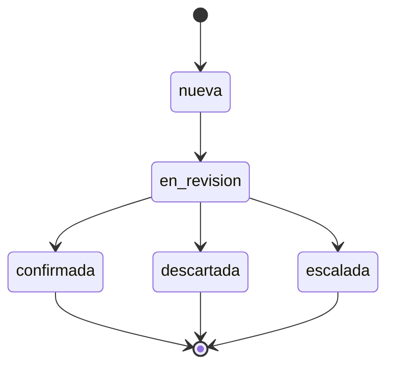

# 06 · Plataforma

Los contratos que las cuatro personas comparten, el árbol del repo, los comandos y las
modalidades de arranque.

> **Por qué este documento existe.** Los contratos de datos también están en
> `CLAUDE.md`, pero `CLAUDE.md` está en `.gitignore`: no viaja en el repo y nadie más
> lo recibe. **Este es el único lugar versionado donde el equipo puede leer los
> contratos.** Si algo de aquí cambia, cambia para los cuatro.

Cada contrato de este documento tiene una prueba que lo sostiene. La columna "prueba"
dice cuál. Un contrato sin prueba es una intención.

---

## 1. Contratos de datos

| Contrato | Decisión | Prueba |
|---|---|---|
| Dinero | `monto_crc`, entero de 64 bits, colones enteros. Nunca flotante. Campo `moneda: "CRC"` desde el día 1 | `prueba_modelos_dominio.py`, `prueba_validadores_mongo.py` |
| Fechas | Siempre ISODate en UTC. El portal formatea a hora de Costa Rica al presentar. Única excepción: `indicadores_diarios.fecha`, texto `YYYY-MM-DD` | `prueba_modelos_dominio.py` |
| Identificadores | Cadenas legibles del `scripts/practica1/CONTRATO-IDS.md` (`CLI-001`, `TXN-001`), nunca ObjectId | `prueba_modelos_dominio.py` |
| Versión de esquema | `esquema_version`, entero, en **todo** documento desde el primero | `prueba_modelos_dominio.py` |
| Nombres | snake_case en español, un solo estilo. Prohibidos `id`, `type` y `class` como nombre de campo | `prueba_modelos_dominio.py` |
| Estados de alerta | `nueva` → `en_revision` → `confirmada` / `descartada` / `escalada` | `prueba_maquina_estados.py` |
| Colecciones | 11 de dominio + 2 de operación = 13 | `prueba_modelos_dominio.py` |

Los 11 modelos Pydantic están en `app/modelos/`, agrupados igual que los scripts de la
Práctica 1 para que cada quien encuentre los suyos donde tiene su script:

| Archivo | Colecciones | Script hermano |
|---|---|---|
| `identidad.py` | `clientes`, `cuentas`, `perfiles_comportamiento` | `a-identidad.js` |
| `transaccional.py` | `transacciones`, `reglas_deteccion`, `listas_riesgo` | `b-transaccional.js` |
| `alertas.py` | `agentes`, `alertas`, `casos` | `c-alertas.js` |
| `cierre.py` | `notificaciones`, `indicadores_diarios` | `d-cierre.js` |

### 1.1 Dinero: "entero de 64 bits" no lo da el modelo

Esto es lo que más fácil se rompe, y romperlo no da error hasta mucho después.

El modelo Pydantic garantiza que `monto_crc` es un entero (`strict=True`, así que
`750000.0` es un error de validación y no una conversión silenciosa). **Lo que el
modelo no puede garantizar es el tipo BSON con el que se guarda:**

| Cómo se escribe | Qué queda en Mongo | Sirve |
|---|---|---|
| `750000` en mongosh | `double` | **No** |
| `750000` como `int` de Python | `int32` (cabe en 32 bits) | **No** |
| `NumberLong(750000)` en mongosh | `long` | Sí |
| `bson.Int64(750000)` en Python | `long` | Sí |

Los validadores declaran `bsonType: "long"`, así que un `int32` **se rechaza**. La
conversión la hace `app/repos/carga_demo.py` al escribir: todo campo que termine en
`_crc` se envuelve en `Int64`. La prueba
`prueba_el_dinero_como_entero_de_32_bits_se_rechaza` verifica las dos mitades: que el
entero pelado se rechaza y que envuelto pasa.

Campos de dinero actuales: `transacciones.monto_crc`, `alertas.monto_crc`,
`perfiles_comportamiento.promedio_crc` y `.maximo_crc`. Un promedio también es dinero:
va redondeado a colón entero, porque SINPE Móvil no opera céntimos.

### 1.2 Fechas

Una fecha sin zona es ambigua: 22:47 en San José y 22:47 en UTC son dos instantes
distintos con seis horas de diferencia, y la regla de horario habitual (R-05) depende
de la hora. Por eso el modelo **rechaza** un `datetime` sin `tzinfo` y normaliza
cualquier otro a UTC.

El cliente de Mongo se crea con `tz_aware=True`; sin eso, una fecha que se escribió en
UTC vuelve sin zona y queda lista para que alguien la interprete como hora local.

Dos excepciones, las dos declaradas:

- `indicadores_diarios.fecha`: texto `YYYY-MM-DD`. Un indicador es de un día
  calendario de Costa Rica, no de un instante.
- `perfiles_comportamiento.horario_habitual`: `{inicio: "07:00", fin: "19:00"}` en hora
  local. "Opera de 7 a 7" es una afirmación sobre el día del cliente.

### 1.3 Identificadores

| Prefijo | Colección | Ejemplo |
|---|---|---|
| `CLI` | `clientes` | `CLI-001` |
| `CTA` | `cuentas` | `CTA-001` |
| `TXN` | `transacciones` | `TXN-001` |
| `REG` | `reglas_deteccion` | `REG-001` |
| `RSK` | `listas_riesgo` | `RSK-001` |
| `AGT` | `agentes` | `AGT-001` |
| `ALR` | `alertas` | `ALR-001` |
| `CAS` | `casos` | `CAS-001` |
| `NOT` | `notificaciones` | `NOT-001` |

Los tipos del modelo llevan el patrón, así que un `CLI-001` donde va un `TXN-001` es un
error de validación y no una referencia rota que aparece tres semanas después.

**Dos colecciones no llevan prefijo, y es a propósito.** Son las materializadas, y usan
su clave natural para que el `$merge` que las produce sea idempotente sin trabajo extra:

- `perfiles_comportamiento._id` = el `cliente_id` (`CLI-001`). Un perfil por cliente.
- `indicadores_diarios._id` = la fecha (`2026-09-24`). Un documento por día. El
  documento lleva la fecha **dos veces**, como `_id` y como `fecha`: el `_id` para la
  idempotencia y el campo `fecha` porque es el que declara el validador.

Una cuenta mula **no** tiene documento en `cuentas`: viaja como número de cuenta dentro
de `transacciones.cuenta_destino` y, si se identifica, como entrada en `listas_riesgo`.

### 1.4 Máquina de estados de la alerta



| Desde | Puede ir a |
|---|---|
| `nueva` | `en_revision` |
| `en_revision` | `confirmada`, `descartada`, `escalada` |
| `confirmada`, `descartada`, `escalada` | nada: son terminales |

Está en `app/modelos/estados.py`, y **solo el arquitecto la cambia**: cambiarla es
cambiar `TRANSICIONES` y su prueba en el mismo commit. H-14 tiene que llamar
`exigir_transicion(origen, destino)` antes de escribir el estado nuevo.

Tres cosas que la tabla decide y conviene tener claras:

- **No existe `nueva → confirmada`.** El agente toma la alerta antes de resolverla, así
  el historial siempre registra quién la tomó. `prueba_todo_lo_demas_se_rechaza`
  recorre los 25 pares posibles y exige que los 21 que no están en la tabla fallen.
- **Los terminales no tienen salida.** Reabrir es crear un caso (colección `casos`), no
  retroceder la alerta, para que el historial no mienta.
- **No existe el estado `resuelta`** que menciona alguna versión vieja de
  `docs/01-vision-y-alcance.md`. Manda esta tabla.

### 1.5 Severidad, y dónde viven los números

`MEDIA`, `ALTA`, `CRITICA`, en mayúscula. **No hay `BAJA`**: si el puntaje no supera el
umbral no se crea alerta (UC-02), así que una alerta de severidad baja no puede existir.

**Los cortes de puntaje NO están en el código ni en el YAML.** Viven en
`politica_deteccion`, para que cambiar un umbral no requiera desplegar. Se lee con
`db.politica_deteccion.findOne({vigente: true})`, y **esta es la forma real del
documento**, no una parecida:

```js
{
  _id: "POL-001",
  descripcion: "Cortes de severidad y umbral de creacion de alerta",
  vigente: true,
  version: 1,                 // version de la politica, distinta de esquema_version
  umbral_alerta: 40,          // bajo esto no se crea alerta
  puntaje_maximo: 100,
  cortes_severidad: [         // ARREGLO de objetos, no un objeto
    { severidad: "MEDIA",   puntaje_minimo: 40, puntaje_maximo: 54 },
    { severidad: "ALTA",    puntaje_minimo: 55, puntaje_maximo: 69 },
    { severidad: "CRITICA", puntaje_minimo: 70, puntaje_maximo: 100 }
  ],
  notificacion: { severidad_minima: "CRITICA", ventana_agrupacion_minutos: 5 },
  esquema_version: 1,
  vigente_desde: ISODate("2026-09-01T00:00:00Z")
}
```

Los pesos de las 6 reglas suman más de 100, así que el puntaje se calcula como
`min(suma, puntaje_maximo)`. `politica_deteccion` no tiene modelo Pydantic todavía: es
de H-07/H-08, y quien lo escriba **lee el documento de la base antes de modelarlo**.

### 1.6 La alerta lleva copia de los campos de despliegue

La fila del panel necesita cliente, cuentas y monto para que el agente decida sin abrir
el detalle. Esos campos van **copiados dentro de la alerta** al momento de crearse, no
resueltos con `$lookup` en cada página:

`cuenta_origen`, `cuenta_destino`, `monto_crc`, `moneda`, `cliente_nombre`.

Dos razones, y ninguna es nueva: "nada se recalcula dentro de una petición HTTP" es una
regla de oro de `docs/04-arquitectura.md`, y es el mismo principio por el que las reglas
disparadas van embebidas: la alerta debe poder explicarse dentro de un año, y para eso
el monto que se vio al crearla no puede depender de que la transacción siga igual. A D1
no le cuesta una consulta extra, porque cuando escribe la alerta ya tiene la transacción
en la mano.

> **Ojo con un mismo nombre que significa dos cosas.** En `transacciones`,
> `cuenta_origen` es el identificador `CTA-001`. En `alertas`, `cuenta_origen` es el
> **número SINPE** (`8712-4455`), porque es un campo para mostrar y el agente lee el
> número, no una llave interna. Está así en el validador y en el modelo.

### 1.7 `reglas_disparadas`: hoy referencias, mañana copia embebida

Hoy `alertas.reglas_disparadas` es la lista de identificadores de regla
(`["REG-001", "REG-002", "REG-003"]`), tal como la fija `CONTRATO-IDS.md`.

`docs/04-arquitectura.md` pide copia embebida con versión, y eso llega en **H-08**,
subiendo `esquema_version` de 1 a 2. **Esa es la migración real que H-26 demuestra el 19
de octubre**, en vez de una inventada para la ocasión. Mientras tanto, el aporte de cada
regla se reconstruye leyendo `reglas_deteccion`.

### 1.8 El historial embebido empieza cuando nace la alerta

`alertas.historial` tiene **al menos una entrada siempre**: la primera es la creación, y
la escribe el motor con `agente_id: null`, porque no la hizo una persona. Los campos son
`accion`, `agente_id`, `fecha` y `nota` (no `agente` ni `ts`, como decía el andamio de la
Práctica 1). H-14 **agrega** a esta lista, nunca la sobrescribe.

### 1.9 Las 13 colecciones

11 de dominio (Práctica 1) más 2 de operación:

| Colección | Qué es |
|---|---|
| `politica_deteccion` | Cortes de severidad y umbral de creación. Por esto los umbrales no están en el YAML |
| `deteccion_estado` | Token de reanudación del change stream, para que H-09 retome donde quedó |

Los nombres se toman de `app/modelos/__init__.py` (`COLECCIONES`, `COLECCION_ALERTAS`,
...) y no se escriben a mano: así un nombre mal escrito es un error de importación y no
una colección vacía que aparece de la nada.

---

## 2. Reglas de arquitectura

Todas verificadas por `pruebas/arquitectura/prueba_capas.py`, que recorre el árbol con
el módulo `ast`. No necesita Mongo ni levantar la aplicación.

| Regla | Por qué |
|---|---|
| `app/deteccion/` no importa `app/api/` | El motor es headless. Si importa la capa HTTP, deja de poder probarse sin levantar un servidor |
| Ninguna consulta a Mongo fuera de `app/repos/` | Para que "qué consultas hace este sistema" se pueda responder mirando una carpeta, y afinar un índice no sea una cacería |
| Un solo cliente de Mongo por proceso, creado en el lifespan | Uno por petición agota los sockets del servidor |
| La URI solo en `config/centinela.yml` | Una URI en el código es un ambiente hundido en el código |
| Solo `app/nucleo/config.py` lee entorno o YAML | Si cada módulo lee `os.environ`, la precedencia deja de ser un contrato |
| El driver es `pymongo.AsyncMongoClient` | Motor está deprecado, fin de vida mayo 2026. Por eso el paquete es `app/deteccion/` y no `app/motor/` |
| Sin emojis en ningún lado | Regla del repo, y la prueba la verifica por rango Unicode |

`app/deteccion/` todavía no existe: la prueba **pasa en vacío** a propósito, para que la
regla ya esté puesta cuando empiece H-09 en vez de llegar después a discutir un import
ya escrito. Hay una contraprueba que verifica que la regla no pasa por no mirar nada.

El ping de `/salud` vive en `app/repos/salud.py` y no en `app/nucleo/db.py`: un ping es
una consulta, y una regla que se incumple el primer día no es una regla.

### Árbol

```
app/
  main.py              FastAPI, lifespan que crea y cierra el cliente de Mongo
  nucleo/
    config.py          clase Ajustes; UNICO lugar que lee entorno o YAML
    db.py              AsyncMongoClient unico; UNICO lugar con la URI
  modelos/             los 11 de dominio, tipos base y maquina de estados
  repos/               UNICO lugar con consultas
  api/
    errores.py         forma estable del error
    esquemas.py        respuestas HTTP
    paginacion.py      acotado de limite
    dependencias.py    inyeccion de ajustes, base y repositorios
    rutas/             salud, alertas
config/centinela.yml   tecnico, sin secretos, sin numeros de negocio
infra/                 docker-compose.yml y .env.ejemplo
pruebas/
  contrato/            configuracion, maquina de estados, modelos, error, OpenAPI, validadores
  unitarias/           paginacion, construccion del filtro
  arquitectura/        las reglas de capas
  dobles/              conjunto de demo y repositorios falsos
tareas.py              lanzador, solo biblioteca estandar
```

---

## 3. Configuración

Precedencia, de mayor a menor. **Verificada por `prueba_configuracion.py`, no a ojo:**

```
entorno  >  config/centinela.local.yml  >  config/centinela.yml
```

El archivo local no se versiona (está en `.gitignore`) y solo necesita las claves que
quiere cambiar: el merge es profundo, así que `app: {pagina_maxima: 25}` no borra el
resto del bloque `app`.

En entorno el prefijo es `CENTINELA_` y el separador de nivel es doble guion bajo:

```
CENTINELA_APP__PAGINA_MAXIMA=25
CENTINELA_MONGO__BASE=antifraude_pruebas
```

**Qué NO va en el YAML:**

- **Secretos.** Van por entorno; el molde está en `infra/.env.ejemplo`.
- **Números de negocio.** Ni umbrales, ni pesos de reglas, ni cortes de severidad: eso
  vive en `politica_deteccion` y en `reglas_deteccion`, en Mongo, para poder cambiarlo
  sin desplegar. Hay dos pruebas que lo vigilan: una recorre las claves del YAML
  buscando palabras de negocio, y la otra es que los bloques de configuración declaran
  `extra="forbid"`, así que **una clave no declarada impide arrancar**. Si alguien pone
  `app.umbral_alerta`, la aplicación no levanta.

`app.pagina_maxima` y `app.pagina_por_omision` sí van en el YAML: son guardas técnicas
de la capa HTTP, no reglas de negocio.

### La URI, una sola para las dos modalidades

```
mongodb://localhost:27018,localhost:27019,localhost:27020/?replicaSet=rsfraude
```

Funciona igual desde el host y desde un contenedor con
`network_mode: service:mongo1`, y no es casualidad: `scripts/init-replicaset.js` declara
los miembros como `localhost:27018/19/20`, y `mongo1` publica esos tres puertos. Desde
el host se alcanza por los puertos publicados; desde un contenedor que comparte el
espacio de red de `mongo1`, los tres nodos están en su propio `localhost`. Cambiarla por
nombres de servicio de Compose rompe la modalidad de host.

**Usar siempre la cadena completa, nunca un nodo suelto.** `mongo1` no siempre es el
primario: después de una elección puede ser `mongo2`, y entonces
`mongosh --port 27018` contesta `not primary`. Con la URI completa, el driver descubre
el primario solo.

---

## 4. Arranque

### El clúster es uno solo, y hay que saber quién manda

Un solo replica set compartido es lo correcto y es lo que el equipo quiere. Lo que no
puede quedar implícito es esto:

- **El proyecto de Compose tiene nombre explícito** (`name: centinela` en
  `infra/docker-compose.yml`). Sin esa clave, el proyecto depende de la ruta donde esté
  clonado el repo; con ella, dos personas con el repo en carpetas distintas obtienen el
  mismo proyecto.

  Lo que esa clave **no** hace es evitar que dos checkouts del repo se peleen los
  contenedores: comparten el archivo, así que antes derivaban todos el mismo nombre y
  ahora usan todos `centinela` — la misma colisión con otro nombre. Lo que la evita es
  la regla de abajo.

- **Los volúmenes son normales: Compose los crea y los administra.** No llevan
  `external: true` ni `name:`, y eso es una decisión con historia. Un volumen declarado
  `external` Compose **no lo crea**: asume que existe, y si no existe `up` falla con
  `external volume "..." not found` antes de arrancar un solo contenedor. En la máquina
  de quien clona el repo por primera vez, en un corredor de CI o en la del profesor el
  día de la defensa, eso es un arranque roto en el primer paso.

  Se habían fijado para conservar una siembra existente, y la cuenta no cerraba: **la
  base entera se regenera en segundos** (`01 → 02 → 03` más los documentos de dominio,
  todo idempotente). Perder un volumen viejo no cuesta nada; que un compañero no pueda
  arrancar cuesta el proyecto. `prueba_infraestructura.py` vigila que no vuelvan.

  Corolario práctico: **verificar el arranque en una máquina que ya tiene los volúmenes
  de corridas anteriores no prueba que funcione en una limpia.** Para probarlo de verdad
  hay que borrar los volúmenes (`python tareas.py abajo --borrar-datos`) o levantar una
  copia aislada del compose con otro nombre de proyecto.
- **Solo el checkout principal corre `docker compose`.** Esta es la regla operativa, y
  no es burocracia: mientras alguna rama todavía tenga el `docker-compose.yml` viejo sin
  la clave `name:`, desde ahí Compose usa el proyecto `infra` con los mismos nombres de
  contenedor, y los dos proyectos se pelean los mismos `fraude-mongo1/2/3`. El síntoma
  es que los contenedores se caen y vuelven a subir solos mientras alguien más verifica.

  Quien solo necesite **ejecutar** algo contra la base no necesita Compose para nada:

  ```
  mongosh "mongodb://localhost:27018,localhost:27019,localhost:27020/?replicaSet=rsfraude" --file /ruta/absoluta/script.js
  docker exec fraude-mongo1 mongosh --port 27018 --quiet --eval "..."
  ```

  **Nunca `docker compose up` desde un worktree.**
- **Los scripts se corren desde el host, con ruta absoluta del host y la URI completa**,
  no con `docker compose exec --file`. El montaje de `/scripts` apunta a la carpeta de
  quien recreó los contenedores de último; desde otro checkout, `--file /scripts/x.js`
  lee el archivo de otra persona o no lo encuentra. `tareas.py` ya lo hace así:

```
mongosh "mongodb://localhost:27018,localhost:27019,localhost:27020/?replicaSet=rsfraude" --file /ruta/absoluta/del/host/scripts/semilla/01-colecciones.js
```

La única excepción es `rs.initiate()`: antes de iniciar el conjunto no hay replica set
que descubrir, así que ese script se corre con conexión directa
(`mongodb://localhost:27018/?directConnection=true`). `tareas.py` también lo hace solo.

### Modalidad A: Mongo en Compose, Python en el host — **probada**

```
python tareas.py instalar     # uv sync: interprete 3.13 y versiones del lock
python tareas.py arriba       # levanta los 3 nodos, inicia el replica set y espera al primario
python tareas.py datos-demo   # siembra estructura, catalogos y el conjunto de demo
python tareas.py dev          # uvicorn con recarga
```

`arriba` espera a que la elección termine antes de reportar. La elección tarda entre 5 y
15 segundos, y sin la espera el comando terminaba mostrando tres `SECONDARY`, que parece
un error y no lo es.

### Modalidad B: todo en Compose — **probada**

```
python tareas.py arriba --con-app   # los 3 nodos mas la API, todo en Compose
python tareas.py datos-demo
```

Para la demo y la defensa. El navegador entra por el puerto publicado, igual que en la
modalidad A, y **la URI del YAML no cambia ni una letra** entre las dos.

Eso último no sale gratis, y conviene entender por qué funciona. El servicio `app` entra
al espacio de red de `mongo1` con `network_mode: service:mongo1`, exactamente como ya
hacen `mongo2` y `mongo3`. Por eso **el puerto 8000 se publica en la lista `ports` de
`mongo1`, no en la de `app`**: un servicio que toma prestada la pila de red de otro no
puede declarar puertos propios, porque no tiene pila propia. El resultado es que
`localhost:27018` y `localhost:8000` significan lo mismo desde el host, desde `mongo1` y
desde el contenedor de la API.

La alternativa —reiniciar el replica set anunciando nombres de Docker— rompería el acceso
desde el host y obligaría a editar el archivo `hosts` en Windows, que es justo lo que esta
topología existe para evitar.

`app` lleva `profiles: ["app"]`, así que un `docker compose up` sin argumentos sigue
levantando solo el replica set. Nadie se encuentra un contenedor nuevo sin pedirlo.

---

## 5. Comandos

| Comando | Qué hace |
|---|---|
| `python tareas.py instalar` | `uv sync` con las versiones exactas del lock |
| `python tareas.py arriba` | Levanta el replica set, lo inicializa y espera al primario |
| `python tareas.py arriba --con-app` | Lo mismo, más la API dentro de Compose (modalidad B) |
| `python tareas.py abajo [--borrar-datos]` | Lo apaga. Con la bandera, borra también los volúmenes |
| `python tareas.py estado` | Estado de los tres nodos |
| `python tareas.py dev` | La API en el host, con recarga |
| `python tareas.py datos-demo` | Siembra y carga el conjunto de demo |
| `python tareas.py pruebas [--tipo ...] [--sin-mongo]` | Las pruebas, por tipo |
| `python tareas.py verificar` | Instala y prueba: lo que se corre antes de pedir revisión |

`tareas.py` usa **solo biblioteca estándar** (`argparse` y `subprocess`), a propósito:
el equipo trabaja en macOS y en Windows, make no viene en Windows, y un `.sh` habría
excluido a media clase. Cualquier comando acepta `--dry-run`.

### Orden de la siembra: 01 → 02 → 03, y no otro

`datos-demo` corre, en este orden:

1. `scripts/semilla/01-colecciones.js` — colecciones con sus validadores
2. `scripts/semilla/02-indices.js` — índices con nombre
3. `scripts/semilla/03-catalogos.js` — catálogo de reglas y política de severidad
4. Los documentos de dominio del caso documentado

**El orden es obligatorio:** `01` hace drop de las colecciones para recrearlas con su
validador, así que corrido después del `03` se lleva el catálogo que el `03` acaba de
escribir. Ya pasó en vivo.

El catálogo de reglas **no** está en el cargador de Python: definirlo en dos lugares es
garantizar que se separen. Los pesos de las reglas son de quien las diseña (H-07).

---

## 6. Contrato HTTP

Publicado como OpenAPI en `/openapi.json`, navegable en `/docs`.

### La forma del error es una sola

```json
{
  "error": {
    "codigo": "parametros_invalidos",
    "mensaje": "La peticion tiene parametros invalidos",
    "detalles": [{ "campo": "limite", "mensaje": "Input should be greater than or equal to 1" }]
  }
}
```

Un 404, un 422 de validación y un 500 inesperado tienen **la misma forma**. No se usa el
`{"detail": ...}` que trae FastAPI porque `detail` cambia de tipo según el caso (texto en
un `HTTPException`, lista de objetos en un error de validación), y entonces el portal
tiene que ramificar por tipo para mostrar un mensaje. Con esto, el portal lee
`error.mensaje` y, si quiere detalle, recorre `error.detalles`.

`codigo` es para el programa y es estable; `mensaje` es para la persona y puede cambiar
de redacción sin romper a nadie. El vocabulario de códigos es cerrado:
`parametros_invalidos`, `no_encontrado`, `conflicto`, `transicion_invalida`,
`base_no_disponible`, `error_interno`.

Una transición fuera de la máquina de estados sale como **409**, no 422: la petición es
válida, lo que no se puede es aplicarla al estado actual del recurso.

El esquema publicado dice la verdad: `prueba_openapi.py` verifica que el 422 documentado
sea `RespuestaError` y no el `HTTPValidationError` que FastAPI documenta por omisión.

### `/salud` y `/estado` son rutas distintas

| Ruta | Responde | Estado |
|---|---|---|
| `GET /salud` | El proceso está vivo y la base contesta. Trae el nombre del replica set y si el nodo es primario | Existe |
| `GET /estado` | El sistema está **haciendo su trabajo**: qué tareas corren o están caídas, último evento procesado, retraso, último error | Existe |

Están separadas porque un proceso vivo con el motor caído es justo el escenario que un
solo endpoint de salud esconde: responde 200 mientras no se detecta un solo fraude.

`/estado` se apoya en `app/supervision/`, que registra cada tarea de fondo y la vigila.
Una tarea que muere no se pierde en silencio: deja el sistema en `degradado` y su último
error queda a la vista. Los disparadores D1, D2 y D3 todavía no existen —son H-09, H-11
y H-22— pero el andamio que los va a vigilar sí, y se prueba matando una tarea a mano.
`/estado` nombra la historia de cada uno, así que la ruta dice quién lo va a construir.

`/salud` responde 200 aunque Mongo no conteste, con `mongo_conectado: false` y el
motivo en `detalle`: la ruta cumplió su trabajo respondiendo, y quien la consulta
necesita el diagnóstico.

### `GET /api/v1/alertas`

| Parámetro | Tipo | Nota |
|---|---|---|
| `estado` | enum de la máquina | Filtro exacto |
| `severidad` | `MEDIA`, `ALTA`, `CRITICA` | Filtro exacto |
| `desde`, `hasta` | fecha con zona | Rango sobre `fecha_creacion`, inclusive en los dos extremos. Sin zona se interpreta como UTC |
| `limite` | entero ≥ 1 | **Acotado por `app.pagina_maxima`** |
| `desplazamiento` | entero ≥ 0 | |

Los filtros son combinables. La respuesta:

```json
{ "total": 3, "limite": 50, "desplazamiento": 0, "elementos": [ ... ] }
```

`total` es el total que cumple el filtro, no el tamaño de la página: el agente necesita
saber cuántas alertas tiene en su cola. `limite` es el que **de verdad se aplicó** tras
acotarlo, que puede ser menor que el pedido; va en la respuesta para que el cliente lo
note.

El orden es `fecha_creacion` descendente con `_id` como desempate. Sin el desempate,
paginar puede repetir un documento o saltárselo.

### El canal SSE: `GET /api/v1/alertas/flujo`

Es cómo la alerta nueva llega al panel sin que el agente recargue. Y la decisión de
fondo, la que hay que no deshacer por error: **no hay bus en memoria.**

El canal observa la colección `alertas` con un Change Stream. La fuente es **lo
persistido**, no un objeto en memoria, así que da igual quién escribió la alerta:
`datos-demo`, D1 dentro del proceso, o el detector corrido por línea de comandos. Todos
aparecen en el panel por el mismo camino.

El diseño anterior tenía un bus en memoria, y tenía tres agujeros: se perdía al
reiniciar, no definía de dónde recuperar lo perdido, y **las alertas de demo insertadas
directo en Mongo nunca habrían aparecido en el panel.** Quitar el bus es menos
maquinaria, no más.

| Pieza | Decisión |
|---|---|
| Identificador del evento | El token de reanudación del Change Stream. Es lo que el navegador devuelve en `Last-Event-ID` |
| Reconexión | Se reabre con `resumeAfter` y ese token, **con el mismo pipeline y las mismas opciones**: cambiarlos al reanudar da comportamiento impredecible |
| Token inservible | Si el oplog ya rodó, Mongo responde `ChangeStreamHistoryLost`. El canal emite un evento `resincronizar` y el panel vuelve a pedir su cola a `/api/v1/alertas` |
| Formato | `ServerSentEvent(raw_data=...)`, **no `data`**: el panel inserta HTML con HTMX, y `data` se serializa como JSON, así que llegaría entrecomillado. Son mutuamente excluyentes |
| Cliente | htmx más la extensión `htmx-ext-sse`, vendorizada como archivo aparte en `app/estaticos/`. **No viene en el núcleo de htmx**, y agrega su propia reconexión con espera progresiva sobre la del navegador |

**Lo que se promete, dicho con precisión.** `Last-Event-ID` lo manda el navegador solo,
pero recuperar lo perdido lo tiene que implementar el servidor: no es automático. Y lo
que este canal promete es **reconstruir el estado de la cola**, no reproducir cada evento
histórico. Para un panel de trabajo eso es lo correcto: el agente quiere su cola como
está ahora, no una repetición de cada transición. Reproducir todo evento exigiría un
registro durable aparte, que ninguna historia ni ningún rubro pide.

**Límite conocido:** un Change Stream por conexión. Con un puñado de agentes está bien;
escalar a decenas pediría un flujo compartido con reparto entre conexiones. Está
documentado, no construido.

---

## 7. Datos de demo

`pruebas/dobles/datos_demo.py`. Pequeño, reproducible y **sin un solo dato inventado**:
todo sale de `CONTRATO-IDS.md` y del caso de `docs/02-casos-de-uso.md` — María Rodríguez,
cuenta `8712-4455`, `TXN-001` de ₡750.000 a las 22:47 hacia la mula `6033-9001`,
`ALR-001` con puntaje 75 resuelta por José Solís, la cadena `RSK-001..004`.

Reproducible sin semilla aleatoria porque son literales: dos corridas dejan la base
idéntica. No usa Faker; el generador con Faker es H-03/H-04/H-05 y es otra cosa.

Escribe con `replace_one(upsert=True)` por documento y **no borra nada más**. Una
versión anterior hacía `delete_many({})` por colección, lo que habría borrado la siembra
de la Práctica 1: un comando de demo no puede destruir el entregable de otra persona.
Tampoco hace `dropDatabase()`, que se llevaría índices y validadores.

Vive en `pruebas/dobles/` porque es un doble de prueba que además sirve de demo, y la
dirección de las dependencias es **pruebas → app**, nunca al revés.

---

## 8. Divergencias abiertas

Anotadas para que nadie las resuelva dos veces, cada una en distinto sentido.

| Divergencia | Estado |
|---|---|
| Los comentarios de ejemplo de `scripts/practica1/*.js` usan `monto` y `fecha`, sin `moneda` ni `esquema_version`, y montos como literal numérico (que mongosh guarda como `double`) | **Los contratos de este documento son los que valen.** Esos archivos quedaron como referencia interna: la Práctica 1 se entregó fuera del repo, así que no son el entregable calificado. Corregir los comentarios está pendiente de decisión, y no urge |
| `scripts/practica1/CONTRATO-IDS.md` lista tres reglas (`REG-001..003`) | El catálogo real tiene seis: se agregaron `R-07`, `R-09` y `R-11`. La fuente viva es `scripts/semilla/03-catalogos.js` |
| `perfiles_comportamiento.desviacion_crc` está en `CONTRATO-IDS.md` pero no en el validador | El modelo lo declara opcional y no lo escribe hasta que el validador lo acepte |
| `casos.fecha_apertura`, `notificaciones.detalle_error`, `indicadores_diarios.calculado_en`, `reglas_deteccion.version` y `.parametros`: el modelo los declara, el validador todavía no | Opcionales en el modelo. Los campos opcionales no se escriben cuando son nulos, porque los validadores declaran `additionalProperties: false` y una clave nula sería una clave desconocida |
| Hay **12 colecciones**, no las 13 de la sección 1.9 | Falta `deteccion_estado`, la del token de reanudación del detector. La crea H-09; 13 es el estado final, no el actual |
| La **reanudación del canal SSE contra Mongo real** no tiene prueba automática | El camino feliz se comprobó a mano contra el clúster de tres nodos: alerta insertada, evento con su token, HTML sin serializar. Lo que falta es provocar `ChangeStreamHistoryLost` de verdad, y eso pide un replica set con `oplogSize` diminuto, un ambiente aparte del suite. Hoy ese camino se cubre con un doble |

Ya resuelta: `docs/04-arquitectura.md` hablaba de React, WebSocket, "motor proceso
aparte" y 11 colecciones. Corregido en H-00B, junto con el glosario y el criterio de
H-17.

---

## 9. Qué falta, y de quién es

H-00A y H-00B están cerradas. Lo que sigue no es de la plataforma:

| Falta | De quién |
|---|---|
| Los disparadores D1 y D2, y la colección `deteccion_estado` | H-09 y H-11 — **B** |
| El disparador D3, que recalcula indicadores | Va con H-22 — **C**. El pipeline y el disparador que lo invoca son una sola unidad de trabajo: repartirlos entre dos personas deja la integración colgando |
| `scripts/procedimientos/` con los recálculos corribles por `mongosh --file` | **A**, y es lo que cubre el rubro 9 de la rúbrica |
| El generador con Faker, a escala de proyecto | H-03 a H-05 — **A** |
| Las plantillas del portal conectadas a Jinja y al canal SSE | H-17 en su segunda mitad — **C** |
| Los endpoints de escritura: resolver una alerta, gestionar reglas | H-14 y H-16 — **D** |

**Dos rubros de la rúbrica siguen sin evidencia**, y valen 6 de 30 puntos: los
disparadores de procesos y los procedimientos almacenados. Los scripts de siembra no
sirven para eso — crean estructura, no reaccionan a cambios ni son rutinas invocables.
La evidencia sale de H-09 y H-11 para el primero, y de `scripts/procedimientos/` para el
segundo.
